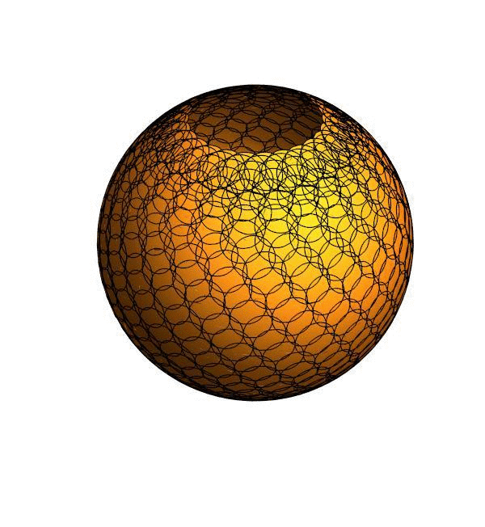

# Визуализация найденной конфигурации, полностью покрывающей заданную облать Земли #

Данная область определяется наклонением орбит группировки КА в 60 градусов.

Визуализации лучших конфигураций по времени: 

спутников на орбите - 11, орбит -59, фазовый сдвиг - 39, всего спутников - 649 

спутников на орбите - 26, орбит -29, фазовый сдвиг - , всего спутников - 754 

